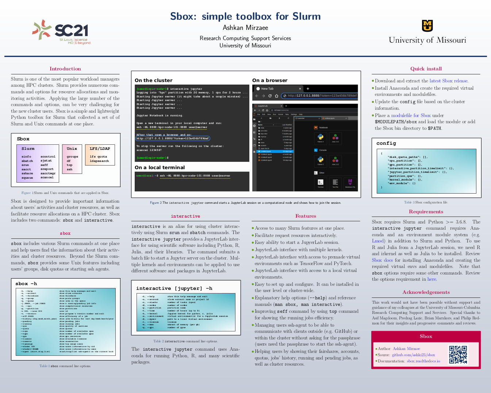

Sbox
====

Sbox is a toolbox for Slurm that provides information about users' accounts and jobs as well as information about the cluster resources. Sbox also can help Slurm admins to collect users' information by user and job IDs. Interactive command uses Slurm ``srun`` and ``sbatch`` commands to request resources interactively including running a Jupyter server on the cluster.

.. note:: The source code and latest release of Sbox is available on the following repository `https://github.com/ashki23/sbox <https://github.com/ashki23/sbox>`__.

Features
--------

* Access to many Slurm features at one place.
* Facilitate request resources interactively.
* Easy ability to start a JupyerLab session.
* JupyterLab interface with multiple kernels.
* JupyterLab interface with access to premade virtual environments such as TensorFlow and PyTorch.
* JupyterLab interface with access to a local virtual environments.
* Easy to set up and configure. It can be installed in the user level or cluster-wide.
* Explanatory help options (``--help``) and reference manuals (``man sbox, man interactive``).
* Improving ``seff`` command by using ``top`` command for showing the running jobs efficiency.
* Managing users ssh-agent to be able to communicate with clients outside (e.g. GitHub) or within the cluster (other nodes) without asking for the passphrase.
* Helping users by showing their fairshares, accounts, quotas, jobs' history, running and pending jobs, as well as cluster resources.

.. toctree::
   :caption: Install
   :maxdepth: 2
   
   requirements

.. toctree::
   :caption: Commands
   :maxdepth: 1
   
   sbox
